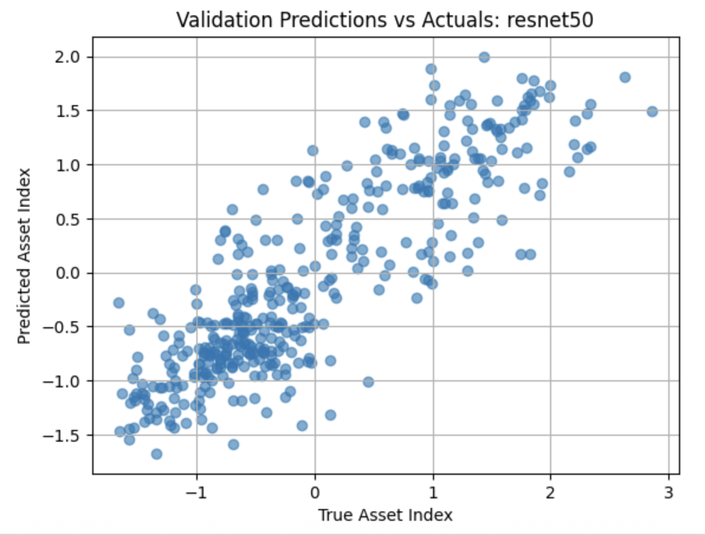
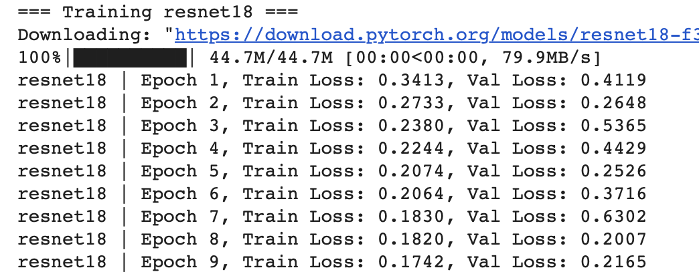
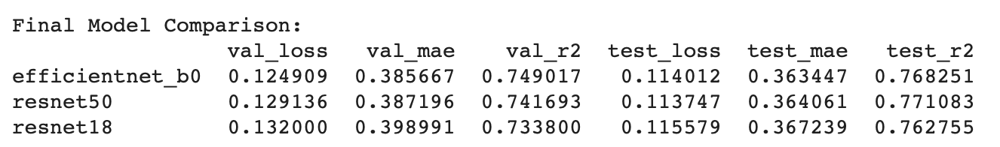

# Poverty Prediction with Satellite Imagery Using CNNs

## Project Summary

This project applies Convolutional Neural Networks (CNNs) to estimate poverty levels in Africa using satellite imagery, specifically the SustainBench SDG1 dataset on poverty change. The goal is to explore how satellite imagery can help track poverty in regions with limited on-the-ground data. The study evaluates three CNN architectures—ResNet18, ResNet50, and EfficientNet-B0—through k-fold cross-validation, comparing their performance and examining prediction quality across the test set. This work demonstrates how machine learning and remote sensing can support socioeconomic analysis when traditional data collection is limited or unavailable.

## Features

- **True Color & False Color Imaging:** Users can choose between RGB (true color: Red, Green, Blue) or NIR-R-G (false color) band compositions, depending on the task.
- **K-Fold Cross-Validation:** Ensures robust performance evaluation across different data splits.
- **Model Comparison:** Evaluates and compares multiple CNN architectures using MAE, R², and loss metrics.
- **Prediction Export:** Saves predictions for downstream mapping and policy-relevant visualization.

## Band Composition Note

By default, this project uses **false-color composite** images with the following band configuration:
- `img_array[3]` → **NIR**
- `img_array[2]` → **Red**
- `img_array[1]` → **Green**

This helps highlight vegetation and land use, which are often predictive of poverty levels.

To use **true-color imagery** (more visually intuitive), modify the image preparation code to:

```python
img_array[1],  # Red
img_array[2],  # Green
img_array[0]   # Blue
```

## Technologies Used

- **Python:** Core programming language
- **PyTorch:** Deep learning framework for model building and training
- **Torchvision:** Pretrained CNN models like ResNet18, ResNet50, and EfficientNet-B0
- **Pandas & NumPy:** Data loading and manipulation
- **OpenCV & PIL:** Image handling and preprocessing
- **Scikit-learn:** Model evaluation (MAE, R²) and K-Fold cross-validation
- **Matplotlib:** Visualization of training curves and prediction results

This is already very clear and well-structured, gabpen! Here's a lightly polished version that improves flow and consistency while keeping your tone intact:

## How to Use

1. **Download the Data:**
   This project uses the **[Africa Poverty Dataset from SustainLab](https://sustainlab-group.github.io/sustainbench/docs/datasets/sdg1/change_in_poverty.html)**.

   To run the model locally, download the following files from the linked Google Drive:

   * `lsms_asset_indices.csv`: Metadata and poverty labels for each image
   * `lsms.tar.gz`: Compressed folder with satellite image patches

   💡 **Note:** Convert `lsms.tar.gz` to `.zip` if needed before use.

   For convenience, this repository already includes:

   * `lsms_asset_indices.csv`

2. **Launch the Notebook:**
   Open `satellite-imagery-poverty-prediction.ipynb` in Google Colab or Jupyter Notebook.

3. **Choose Image Bands:**
   By default, the model uses **false-color imagery** with Near-Infrared (NIR), Red, and Green bands:
   `img_array[3], img_array[2], img_array[1]`
   To switch to **true-color**, use:
   `img_array[2], img_array[1], img_array[0]`

4. **Train the CNN Models:**
   Run all cells to train **ResNet18**, **ResNet50**, and **EfficientNet-B0** using 5-fold cross-validation.

5. **Visualize and Compare:**
   
Explore training and validation curves, and review a final comparison table with MAE, R², and test loss for each model.

## Example Showcase

### Visualizations

- **Figure 1:** Training and Validation Loss Curves for ResNet50



- **Figure 2:** Scatter Plots of Predicted vs. True Asset Index



- **Figure 3:** Final Model Comparison Table



## Key Results

| Model          | Test MAE |  Test R² |
|----------------|----------|----------|
| EfficientNet-B0| 0.363    | 0.768    |
| ResNet50       | 0.364    | 0.771    |
| ResNet18       | 0.367    | 0.763    |

- All models achieved R² values above 0.75, with **EfficientNet-B0** showing the best trade-off between performance and training time.
- The differences in performance were relatively small, suggesting that any of the three CNNs could be a good choice depending on resource constraints.

## Conclusion

This project demonstrates how satellite imagery combined with deep learning can be used to estimate poverty levels in low-data contexts. It showcases the practical application of CNNs for development economics and provides a reproducible workflow for comparing models, interpreting results, and generating data products for policy use.

